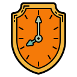

# Time Shield Chrome Extension

Time Shield is a productivity Chrome extension designed to help users manage their time spent on restricted websites more effectively. By tracking the amount of time spent on user-defined restricted sites, Time Shield encourages healthier browsing habits and enhances focus.

## Features

- **Website Restriction**: Users can define a list of websites (restricted sites) that they want to spend less time on.
- **Time Tracking**: Time Shield tracks the time spent on these restricted sites and displays it via a badge on the extension icon.
- **Daily Time Limits**: Set daily maximum allowed time for browsing restricted sites. Once the limit is reached, the user is notified.
- **Focus Mode**: Automatically stops the timer when Chrome loses focus or when navigating away from restricted sites, ensuring that time tracking is as accurate as possible.
- **Persistence**: Time spent on sites and remaining time are saved across browser sessions to keep track of user progress.
- **Notifications**: Alerts users when their allotted time for restricted sites has been exhausted.

## Installation

### From Chrome Web Store
1. Visit the [Time Shield Chrome Web Store page](https://chrome.google.com/webstore/category/extensions)
2. Click "Add to Chrome"
3. Follow the prompts to complete installation

### Manual Installation (Developer Mode)
1. Download or clone this repository
2. Open Chrome and navigate to `chrome://extensions/`
3. Enable "Developer mode" in the top right
4. Click "Load unpacked"
5. Select the `src` folder from the downloaded repository

## Usage

1. Click the Time Shield icon in your Chrome toolbar
2. Add websites you want to limit time on (e.g., "facebook.com", "twitter.com")
3. Set your daily time limit in minutes
4. Optional: Click "Lock Time" to prevent changes to the time limit for the rest of the day
5. The extension badge will show your remaining time and change color:
   - Blue: Normal operation
   - Red: Less than 5 minutes remaining

## Privacy

Time Shield respects your privacy:
- All data is stored locally on your device
- No data is collected or transmitted to external servers
- No tracking or analytics are implemented

## Contributing

Contributions are welcome! Please feel free to submit a Pull Request. For major changes, please open an issue first to discuss what you would like to change.

## Development

### Prerequisites
- Google Chrome Browser
- Basic knowledge of JavaScript and Chrome Extension APIs

### Setup
1. Clone the repository
2. Make your changes
3. Test locally using Chrome's developer mode
4. Submit a pull request

## License

This project is licensed under the MIT License - see the LICENSE file for details.

## Support

If you encounter any issues or have suggestions, please:
1. Check the [existing issues](https://github.com/VASHvic/time-shield/issues)
2. Create a new issue if your problem isn't already listed
